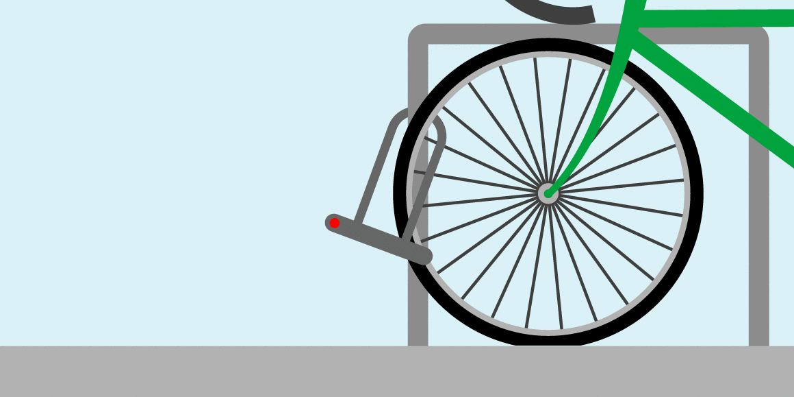
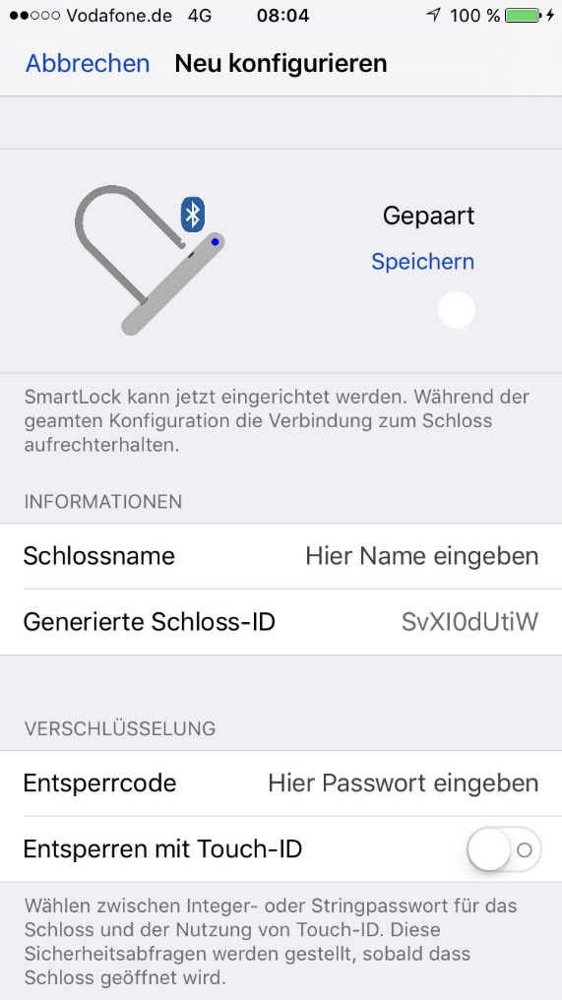
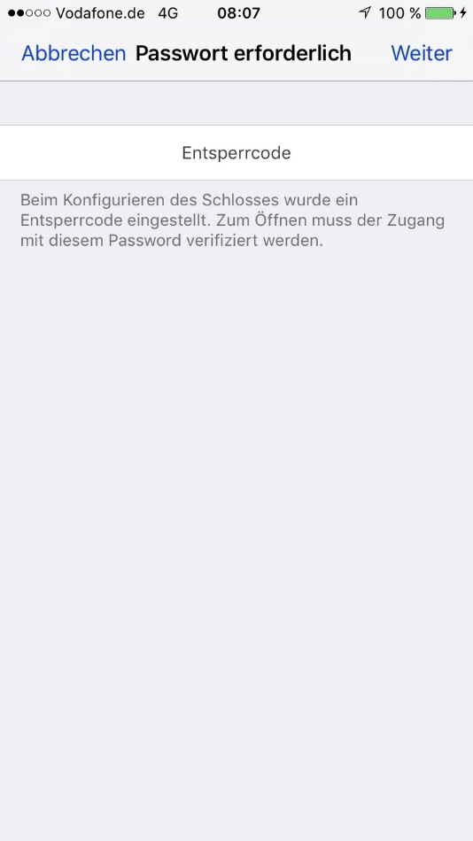
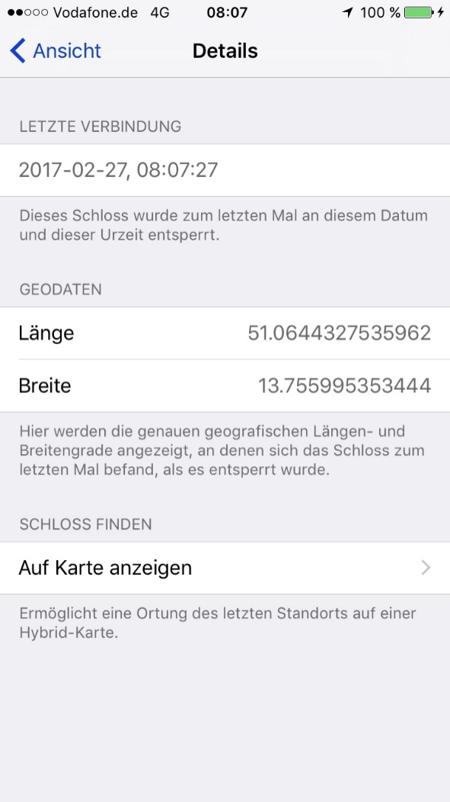
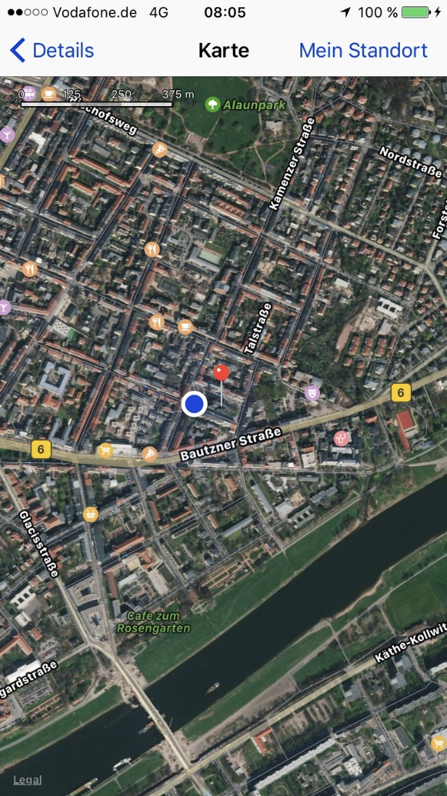
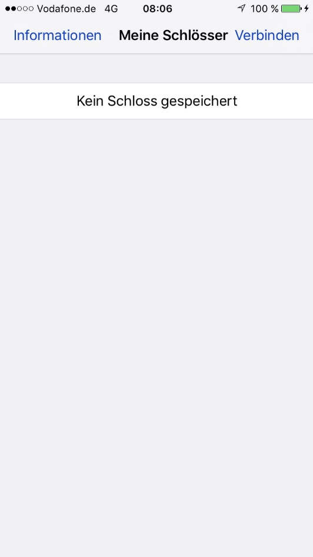
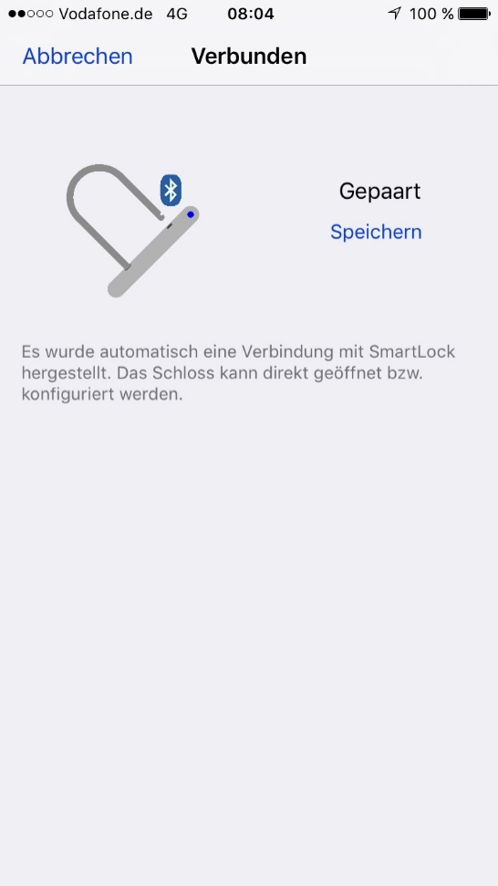

# SmartLock

### Application for storing user profiles of a wireless locking mechanism

## Table of Contents

1. [Overview](#overview)
2. [Functionality](#functionality)
	- [Creating a new lock profile](#creating-a-new-lock-profile)
	- [Finding a lost lock](#finding-a-lost-lock)
	- [Connecting to a lock](#connecting-to-a-lock)
3. [Deprecation Warning](#deprecation-warning)

## Overview

This project is part of my A-level's final thesis (BeLL). It was part of _Jugend Forscht 2017_. This project was an attempt to build my first iOS app. 

## Functionality

SmartLock is a counter part to an Arduino-equipped bycicle lock. While the main objective was to control the lock with the app, I didn't get it to connect. I instead focussed on creating the logic and UI for the rest of the app.

### Creating a new lock profile

<div class="pair">
	
	
</div>

> Fig. 1: Configuring a new lock

> Fig. 2: Passcode prompt

On connection to the lock, the user gets prompted to create and customize a profile for the lock and to set a authentification method.

### Finding a lost lock

<div class="pair">
	
	
</div>

> Fig. 3: View lock metadata

> Fig. 4: Lock location on map

After locking a lock, the location is stored on the device. In the case of a lost lock, the user can pinpoint its location on a map. 

A notification will be sent reminding the user if a recently locked lock is lost.

### Connecting to a lock

<div class="pair">
	
	
</div>

> Fig. 5: No locks are configured

> Fig. 6: Pseudo-pairing

This is the part I never actually implemented. For demoing purposes, the view controller gets presented a small amount of time after the connection is established by the user. 

## Deprecation warning

> ⚠️ This project is not well documented and contains source code developed with ```Swift 3.x``` when I barely knew programming. It has to be migrated to a newer Swift version and needs a lot of refactoring.

<style>
	.pair { }
	.pair > img { 
		display: inline-flex;
	}
	.pair > * {
		padding: 1em 0.5em;
		height: 500px;
	}
</style>